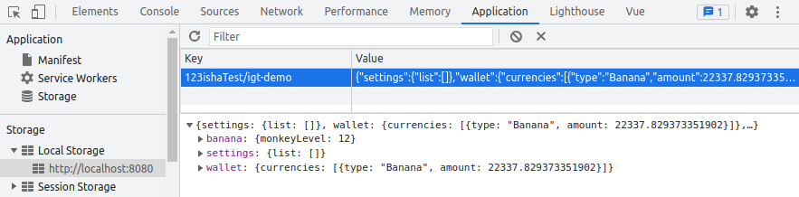

# Gaining Bananas
Let's gain some bananas! We will create a new Feature that generates 1 banana per second.
If you think that is too little, don't worry! We will also add an `Upgrade` that allows us to level up our gains.

Before we get into coding, it is a good idea to think about the dependencies this feature will have.
It will need to depend on the wallet which is responsible for keeping track of how many bananas we have.
This dependency can be injected in the `initialize(features: MyFeatures)` method of a `Feature`, which is what we'll do!

## Create a BananaProducer feature
Make a new file `src/my-game/features/banana-producer/BananaProducer.ts`.
@[code{51-85} ts](patches/3.1-create-banana-producer.patch)

Note that when a game is started, first the constructor is called, then initialize, then update.
If you have attributes that depend on other features, you need to initialize them in the `initialize()`.

::: warning
The syntax `private _wallet: IgtWallet = undefined as unknown as IgtWallet;` is not great.
But it works without needing complicated Dependency Injection tools. If you know a better way, let me know!
:::

Don't forget to add the Feature to our `App` and `MyFeatures.ts`:
@[code{15-32} diff](patches/3.1-create-banana-producer.patch)
@[code{35-44} diff](patches/3.1-create-banana-producer.patch)


If we refresh our browser, we can now see the banana count go up!

The save and load methods are empty for now, but we'll use them later to save our upgrades bought.

## Adding an upgrade
We are clearly not getting enough bananas per second, so it is time to add an Upgrade.
Upgrades are a bit complex. They need access to the wallet to know if they can be bought.
Since Features aren't globally accessible, we will have to complicate our implementation a bit.

Luckily the `igt-library` provides a mixin called AddWallet.
When we apply this mixin, it provides the private `_wallet` and two method that allow the feature to buy upgrades `buyUpgrade(upgrade: IgtAbstractUpgrade)` and `canAfford(upgrade: IgtAbstractUpgrade)`.

:::tip
If you're not familiar with mixins, they are a nice way to share behaviour between classes without inheritance.
https://www.typescriptlang.org/docs/handbook/mixins.html
:::

@[code{12-49} diff](patches/3.2-add-monkey-upgrade.patch)
The `igt-library` contains 2 types of upgrades: The `DiscreteUpgrade` and the `ContinuousUpgrade`.
They are very similar, but the `DiscreteUpgrade` requires a list of costs and a list bonuses, while the `ContinuousUpgrade` requires 2 functions that return the cost and bonus per level.
We use the following cost function, but feel free to tweak it to your liking.
```ts
level => {
    return new Currency(20 * Math.pow(level + 1, 1.4), CurrencyType.banana);
}
```

This works well, however we need to create a Vue component to actually render our feature and to allow for buying the upgrade!

## Creating a new Vue component
We will use the `igt-upgrade` component to easily render our upgrade. We do need to bind the upgrade function ourselves, and tell the upgrade when it can be bought.

@[code{39-76} vue](patches/3.3-add-banana-producer-component.patch)

And of course actually use it in our `VueApp.vue`
@[code{14-35} diff](patches/3.3-add-banana-producer-component.patch)

And voilà, we have a working upgrade in our application!

You might have noticed however, that when we refresh, our upgrade level isn't saved.
Our banana count is saved however, the `IgtWallet` automatically saves any currencies you store in it!

But let's implement saving for our upgrade.

## Saving and Loading
The base class `IgtFeature` we're extending from implements an interface called `Saveable`.
This interface requires us to implement a save and load method with this signature:
```ts
export interface Saveable {
    saveKey: string;
    save(): SaveData;
    load(data: SaveData): void;
}
```
Where `SaveData` is an empty interface we'll be extending.
Currently, our BananaProducer only needs to save the level of our upgrade, so that's all we need to add to our `BananaProducerSaveData.ts`.
@[code{47-54} ts](patches/3.4-save-banana-producer.patch)

The `save()` and `load()` methods are automatically called by the `IgtGame`, so all we need to do is implement their functionality.
@[code{14-43} diff](patches/3.4-save-banana-producer.patch)

::: tip
The default save time is 30s, if you think this is too low, you can override it in `MyGame.ts`
```ts
protected readonly SAVE_INTERVAL: number = 10;
```
:::

::: warning
When loading, it is possible for data to not exist because a save is older.
It is a good idea to add sensible defaults like 0 for the upgrade level.
```ts
this.monkeyUpgrade.level = data.monkeyLevel ?? 0;
```
:::

If you open the localStorage tab in your browser, you can confirm the data is saved correctly:



Congratulations, you have just created your first `Feature` with the Incremental Game Template!

If you have any feedback on this tutorial, please [let me know](https://discord.gg/AvNpq6Ng6S)!

::: tip
In the future more tutorial stuff will be added, stay tuned!
:::
